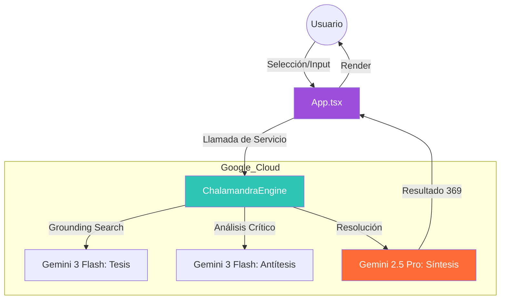

# Chalamandra QuantumMind v4.1.0

### Dialectical AI Engine: Chola | Malandra | Fresa | Salamandra

Chalamandra es una extensión de Chrome de alto rendimiento que utiliza la **API de Gemini 3** para procesar la realidad a través de una tríada dialéctica. No solo responde; decodifica la información mediante una Tesis (con búsqueda en Google), una Antítesis crítica y una Síntesis magistral.

---

## 🏗️ Arquitectura del Sistema
El siguiente diagrama detalla cómo los componentes que hemos verificado interactúan entre sí:

