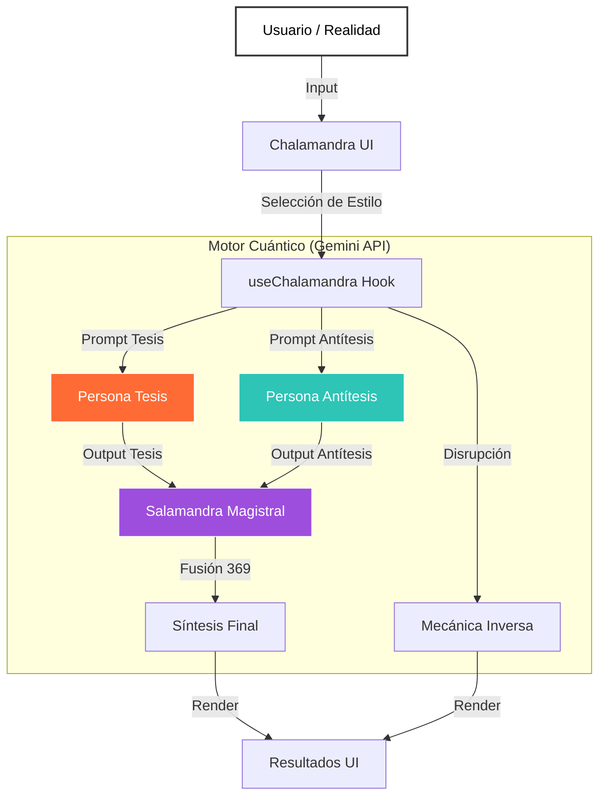

# Chalamandra Magistral DecoX

> **Motor Dialéctico Cuántico v4.1**
> *Decodificando la realidad a través del caos y el orden.*


## 🌌 Visión

Chalamandra Magistral DecoX es una herramienta de pensamiento asistido por IA que utiliza el método dialéctico (Tesis, Antítesis, Síntesis) potenciado por personalidades arquetípicas (Chola, Malandra, Fresa, Ballerina, Ballet, Folklórico) para descomponer ideas complejas, desafiar narrativas y encontrar una verdad superior (SÍNTESIS 369).

No es solo un chat; es un **colisionador de conceptos**.

## 🧠 Arquitectura Modular (Mermaid)



## 🎭 Módulos de Personalidad

El sistema opera mediante "Nodos de Personalidad" intercambiables:

| Módulo | Arquetipo | Color (Hex) | Función |
|--------|-----------|-------------|---------|
| **Chola** | Barrio Root | `#FF6B35` | Realidad cruda, directa, callejera. |
| **Malandra** | Estrategia | `#2EC4B6` | Astucia, supervivencia, táctica. |
| **Fresa** | Tech/Elite | `#E71D36` | Académico, estructurado, aspiracional. |
| **Ballerina** | Flow | *TBD* | Fluidez, arte, emoción. |
| **Ballet** | Estructura | *TBD* | Disciplina, técnica, perfección. |
| **Folklórico** | Raíz | *TBD* | Mito, narrativa, color, ancestros. |

*(Nota: Los colores y símbolos para los nuevos módulos se definirán con tu input)*

## 🛠️ Instalación y Desarrollo

### Prerrequisitos
- Node.js v18+
- API Key de Google Gemini

### Setup Local

1.  **Clonar el repositorio:**
    ```bash
    git clone https://github.com/tu-usuario/chmadex-dial.git
    cd chmadex-dial
    ```

2.  **Instalar dependencias:**
    ```bash
    npm install
    ```

3.  **Configurar entorno:**
    Crea un archivo `.env.local` y añade tu llave:
    ```env
    GEMINI_API_KEY=tu_api_key_aqui
    ```

4.  **Ejecutar en modo desarrollo:**
    ```bash
    npm run dev
    ```

### Construcción (Build)

Para generar la extensión lista para producción:

```bash
npm run build
```

La carpeta `dist/` contendrá todos los archivos necesarios para cargar la extensión en Chrome ("Load Unpacked").

## 🚀 Despliegue

Este proyecto está configurado para Vercel (versión web) y Chrome Web Store (extensión).

1.  **Vercel:** Conecta tu repositorio y configura la variable de entorno `GEMINI_API_KEY`.
2.  **Extension:** Sube el zip de la carpeta `dist/` al Developer Dashboard de Chrome.

## 🔒 Seguridad y Privacidad

- **Zero-Log:** No guardamos tus consultas en servidores propios. Todo pasa de tu navegador a Google Gemini directamente.
- **Local Storage:** El historial inmediato se guarda en tu navegador localmente.
- **Auditoría:** Código abierto y transparente.

---

**Chalamandra Magistral DecoX** — *Decodificando el caos, ordenando el cosmos.*
